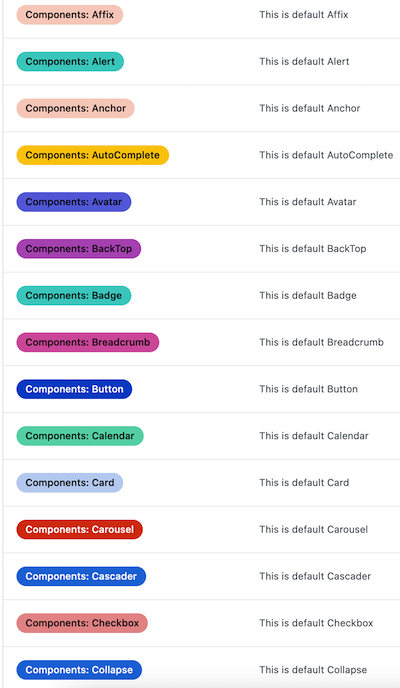

# 🚀 Labels 助手

自动批量新增、删除标签。

因为这些操作大部分都是 一次性的，所以没有做成 GitHub Actions，建议 Fork 项目，然后在本地运行即可。

> 这只是个简单的例子，你可以自定义修改任何代码，来实现自己的功能。
>
> 若你需要的场景功能未提供，可新开 issue 提出。

## 💄 预览

## 📦 如何使用？

<kbd>环境: node</kbd>

1. Fork 这个项目
2. 修改 `create.json` 或 `delete.json`
3. `yarn`
4. `yarn run xx`

## 🤖 脚本说明

`create.json` `delete.json` 作为配置项，供 src 下脚本使用。

- `copy`：一键 copy 指定仓库 labels 到 目前仓库
  - token 必须拥有 目标仓库的 write 权限
  - get 为指定仓库
  - target 为目标仓库
  - ignore 忽略新增的 labels
- `create`：根据仓库目录新增 labels
  - path 指定仓库路径
  - ignore 忽略路径文件
  - format 名字格式化
  - desc 描述格式化
  - color label 颜色，可设置 auto 系统随机自动
- `delete`：删除目前仓库的 label
  - include 名称包含，可不设
  - ignore 忽略删除 label

## LICENSE
asdfda